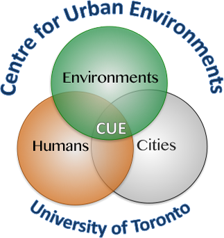

University of Toronto | Center for Urban Environments
----------------|-----------------------------------
Feb 25 2021   | **Instructor**: [Alessandro Filazzola](http://www.filazzola.info)
12:00 pm - 1:00 pm   | 

## General Information

Statistical software that are also programming languages, such as R, are excellent tools for conducting analyses of biological data. However, many users are not taking full advantage of their capabilities. This workshop is an introduction to some of the resources that are available to R users that have been developed and implemented in the larger programming community. No prior knowledge of R will be necessary, but this workshop will not be an introduction to R basics. Instead, we will focus on using R Studio and Github to easily sync your data and analyses online. Within this workshop we will explore how to maximize reproducibility, collaborate internationally on statistical analyses, present data summaries, data management, and the promotion of open science. This workshops will be a whirlwind tour of the functionality and features of using Git with Rstudio. 

**Who**: The course is aimed at R beginners or experienced analysts. You do not need to have previous knowledge of R.

**Where**: University of Toronto. Meeting ID: [872 1457 1678](https://utoronto.zoom.us/j/87214571678) Passcode: 128987

**Requirements**: Participants should use a laptop with a Mac, Linux, or Windows operating system (not a tablet, Chromebook, etc.) with administrative privileges. If you want to work along during tutorial, you must have both Git & R studio installed on your own computer (See below for instructions). Ideally, two screens would be beneficial to see the video and your workstation at the same time. However, Participation is not necessary and you can simply follow along as I demonstrate. 

**Contact**: Please contact alex.filazzola@outlook.com for more information.

[Live Notepad](http://localhost:9001/p/r.694a6019131d6fc446fee3c32f6de87d)

## Schedule

Time   | Goal
-------|------------
12:00 pm  | Meet & greet.
12:05 am | [Github Introduction](Github/Github.html)
12:20 pm | [Github and R Studio](Git.rstudio/Git.rstudio.html)
12:40 pm | [Creating Reports with R Studio](Reports/Reports.html)
12:50 pm  | [Publish Reports and websites](Website/website.html)

## Software

Please install Git **before** installing R Studio. This allows seamless integration between the two programs because R Studio looks for Git on your computer, but Git does not look for R Studio. In the past, installation in the opposite order has been known to create issues. If you already installed R Studio and Git, but do not see the Git Tab in R Studio then you can follow [this support page](https://support.rstudio.com/hc/en-us/articles/200532077-Version-Control-with-Git-and-SVN) to troubleshoot. 

### Git

Git is a version control system that lets you track who made changes to what when and has options for easily updating a shared or public version of your code on github.com. You will need a supported web browser (current versions of Chrome, Firefox or Safari, or Internet Explorer version 9 or above).

You will need an account at [github.com](https://github.com/) for parts of the Git lesson. Basic GitHub accounts are free and premium accounts are free to students. We encourage you to create a GitHub account if you don't have one already. Please consider what personal information you'd like to reveal. For example, you may want to review these instructions for keeping your email address private provided at GitHub.

Information on how to install Git for each OS is provided by [Software Carpentry](https://software-carpentry.org/) and can be found [here](install.html)

### R

[R](http://www.r-project.org/) is a programming language that is especially powerful for data exploration, visualization, and statistical analysis. To interact with R, we use [RStudio](http://www.rstudio.com/).

Windows        |   Mac OS  X   |      Linux
---------------|---------------|---------------
Install R by downloading and running [this .exe](http://cran.r-project.org/bin/windows/base/release.htm) file from [CRAN](http://cran.r-project.org/index.html). Please also install the [RStudio IDE](http://www.rstudio.com/ide/download/desktop).| Install R by downloading and running [this .pkg](http://cran.r-project.org/bin/macosx/R-latest.pkg) file from [CRAN](http://cran.r-project.org/index.html). Please also install the [RStudio IDE](http://www.rstudio.com/ide/download/desktop).|You can download the binary files for your distribution from [CRAN](http://cran.r-project.org/index.html). Please also install the [RStudio IDE](http://www.rstudio.com/ide/download/desktop)

## Other workshops

If you enjoyed this workshop and were interested in learning more, I have also run workshops on [Logistic Regression](https://github.com/afilazzola/CUELogisticRegression), an [Introduction to Ecological Analyses](https://afilazzola.github.io/UoA.CommunityAnalyses.2018/), and an [Introduction to Functions](https://afilazzola.github.io/Intro2Functions/)

You can find similar style workshops, usually that are longer and go into more detail, with [Software Carpentry](https://software-carpentry.org/). They have teachers available globally and cover all forms of programming beyond R. 

 

## Thank You!

 

 Center for Urban Environments         |  University of Toronto
:-------------------------------------:|:-------------------------:
                |  
 
